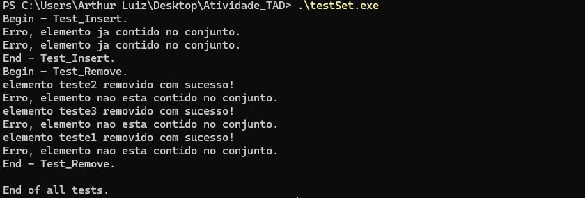
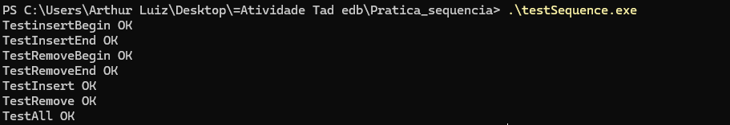

# Estruturas de Dados - IMD0029
# Autor: Arthur Luiz Rosado Alves
# Professor: João Guilherme

Repositório para a **Atividade 02 | Unidade II** .

1 - Descrição dos métodos implementados. 

2 - Print do terminal ao executar os testes sobre os métodos implementados. 

3 - Cada grupo deve enviar apenas um relatório. 

---

##  Sumário
1. [Compilação e Testes](#c1)  
2. [Funções Implementadas](#c2)  
3. [Estrutura do Repositório](#c3)  
4. [Link do Repositório](#c4)  

---

# <a name="c1"></a>1. Compilação e Testes

## Via powershell - TadConjunto

``` g++ -std=c++11 ArraySet.cpp main.cpp -o testSet.exe ```

Execute: ``` .\testSet.exe ```



## Via PowerShell - TadSequence

``` g++ -std=c++11 ListSequence.cpp TestSequence.cpp -o testSequence.exe ```

Execute: ``` testSequence.exe ```


